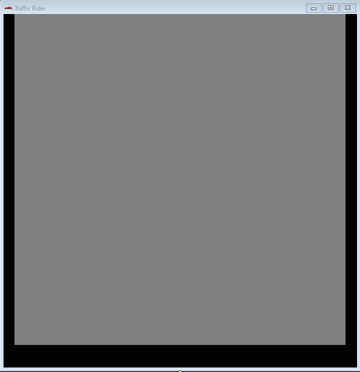

# Traffic-Rider
## Proje Tanıtımı
Projemde C# Windows Form Application kullanarak(.NETFramework version="v  4.7.2") bir araba yarışı oyunu geliştirmek istiyorum. Oyunumuzu aracın dışından bakarak kuş bakışı şekilde(top-down-view) oluşturduğumuz 3 şeritli yol üzerinde önüne çıktığı araçlardan klavyemizdeki "A" ve "D" tuşlarını kullanarak kaçmaya çalıştığımız bir oyun olmasını düşünüyorum. Metreye bağlı olarak rekor skorlarımızın alt sekmede tutulacağı yerde
hız ve anlık gidilen metre hesabını da tutarak oyuncuya rekoru kırması için bir heyecan yüklemiş olabiliriz. 
Önüne çıktığı araçlara çarptığı anda ise kaza ses efekti koyarak oyuncunun kaza yaptığını bildirebiliriz.

## Projeye Başlangıç
Projemi oluşturmak için Visual Studio 2019 uygulamasını açıp yeni bir proje oluştur kısmından Windows Form Uygulaması(.NET Framework)'nı seçerek projemi oluşturdum. Form kontrolleri üzerinden sekme başlığındaki Form1 Textini ve iconunu oyunuma uygun olması için ismini **Traffic Rider** olarak düzenledim. Oyunumun görüntüsü göze hoş gelmesi için size boyutunu 723;745 olarak belirledim. Yol ve şeritlerle uyumlu olması için arka plan rengini gri olarak ayarladım. Oyun ekranımın alt kısıma skor bilgilerinin tutulduğu sekmeyi ayarlamak için araç kutusundan label ekleyip gerekli renk ve size ayarlarını yaptıktan sonra güzel durması için sağ ve sol kenarlara da siyah label ekledim. Şeritlerimi oluşturmak yeni bir label ekleyip boyutunu 11;110 , rengini beyaz olarak ayarlayıp auto-size özelliğini false yaptım. Araba görünümlerini eklemek için proje dosyalarımdaki Properties içindeki Resources.resx dosyasına resimlerini ekledim. Araba görüntümü oyun ekranına eklemek için araç kutusundan picturebox ekleyerek arabamı oyuna dahil ettim. Alttaki skor bilgilerini gireceğim label içerisine hız, katedilen yol ve yüksek skor bilgilerini eklemek için yeni labeller ekledim. Kodlama aşamasında isim zorluğu yaşamamak için label ve picture isimlerini değişitirdim.

