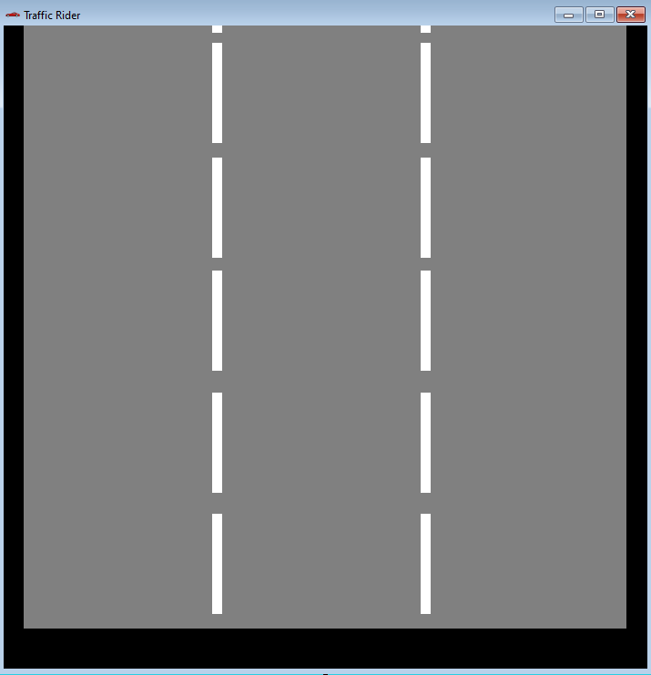
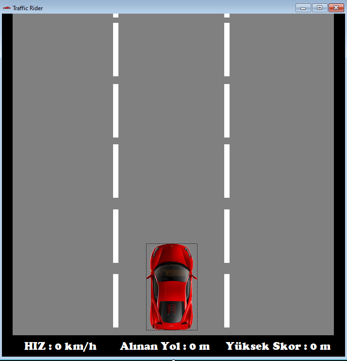
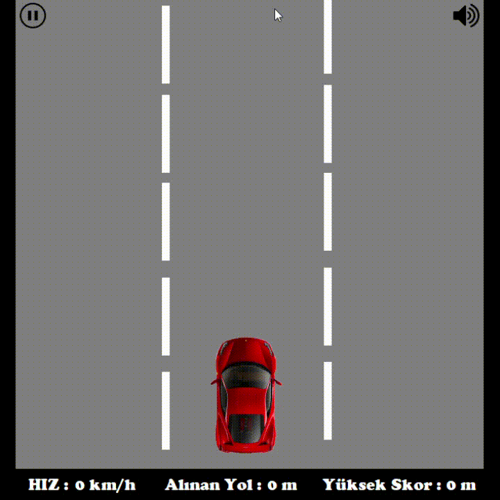
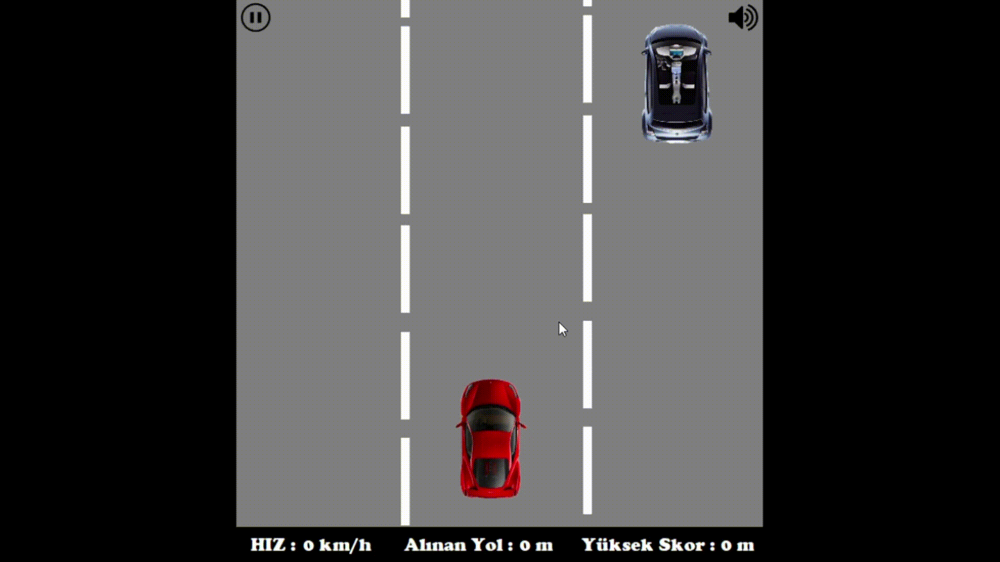

# Traffic-Rider
## Proje Tanıtımı
Projemde C# Windows Form Application kullanarak(.NETFramework version="v  4.7.2") bir araba yarışı oyunu geliştirmek istiyorum. Oyunumuzu aracın dışından bakarak kuş bakışı şekilde(top-down-view) oluşturduğumuz 3 şeritli yol üzerinde önüne çıktığı araçlardan klavyemizdeki sağ ve sol okları veya "A" ve "D" tuşlarını kullanarak kaçmaya çalıştığımız bir oyun olmasını düşünüyorum. Metreye bağlı olarak rekor skorlarımızın alt sekmede tutulacağı yerde
hız ve anlık gidilen metre hesabını da tutarak oyuncuya rekoru kırması için bir heyecan yüklemiş olabiliriz. 
Önüne çıktığı araçlara çarptığı anda ise kaza ses efekti koyarak oyuncunun kaza yaptığını bildirebiliriz.

## Projeye Başlangıç
* Projemi oluşturmak için Visual Studio 2019 uygulamasını açıp yeni bir proje oluştur kısmından Windows Form Uygulaması(.NET Framework)'nı seçerek projemi oluşturdum.
* Form kontrolleri üzerinden sekme başlığındaki Form 1 yazısını text sekmesinden düzenleyip gerekli boyut ayarlamalarını yaptıktan sonra oyun arayüzüme uygun olması için arka plan rengini ayarladım. Daha sonrasında Alt sekmede tutmayı planladığım skor bilgileri için araç kutusundan label ekleyerek arayüz düzenlemelerimi yaptım.
* Daha sonrasında şeritlerimizi eklemek için yeni bir label ekleyerek şerit düzenlemelerini yaptım.
* Araba görünümlerini kod dosyalarının içine ekleyip araç kutusundan picturebox eklentisiyle arabamı dahil ettim.
* Alt kısıma eklemiş olduğumuz label içerisine yeni bir label ekleyerek hız, alınan yol ve yüksek skor değerlerini ekledim.

  

* Daha sonrasında aracımızın sağa ve sola yön hareketlerini ayarlamak için **key prewiew** özelliğini true hale getirip olaylar kısmından keydown eventi üzerinde if else kullanarak tuşlara basıldığında sağa sola geçme eventini ayarladıktan sonra yeni bir void oluşturarak tuşa basıldığında aracın hangi konumda olması gerektiğini düzenledim.
* Oyun zevkimizin artması için rastgele müzik gelmesini planladığım müzikler için random yapısını ekleyip voide ekledim. **axWindowsMediaPlayer** yapısıyla dosyamızdan müziği çekerek oyunda çalmasını sağladım.
* Herhangi bir sıkıntı durumunda oyunumuzun durdurulması veya müzikten rahatsız olan oyuncu için müziği kapatma ve açma tuşu ekledim.
* Aracamıza hareket ettiriyor görüntüsü vermek için şeritlerimiz aşağı ve yukarı hareket ettirerek aracımıza gidiyor izlenimi veriyorum. Şeritleri for döngüsü kullanarak sonsuz döngüye sokup aracımız oyun durdurulana kadar veya çarpana kadar aracımız hareket ediyor olarak gözükecektir.

* Daha sonra karşımıza çıkacak araçları oyuna dahil etmek için yeni bir class oluşturup içine oyuna dahil edeceğimiz araçların resimlerini aktardım.
* Karşımıza çıkacak olan arabaları döngüye sokarak sürekli gelmelerini sağlayıp araç boyutlarını orantıladım. Her şeride en fazla 2 tane araç gelebilecek şekilde düzenledim.

